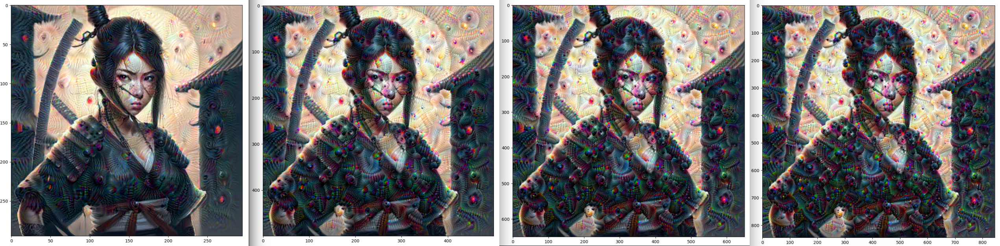

# Tensorflow Deep Dream

[DeepDream](https://ai.googleblog.com/2015/06/inceptionism-going-deeper-into-neural.html) is an experiment that visualizes the patterns learned by a neural network. Similar to when a child watches clouds and tries to interpret random shapes, DeepDream over-interprets and enhances the patterns it sees in an image.


It does so by forwarding an image through the network, then calculating the gradient of the image with respect to the activations of a particular layer. The image is then modified to increase these activations, enhancing the patterns seen by the network, and resulting in a dream-like image. 


The following code is taken from one of the [official Tensorflow Tutorials](https://www.tensorflow.org/tutorials/generative/deepdream).


```py
python main.py
```


